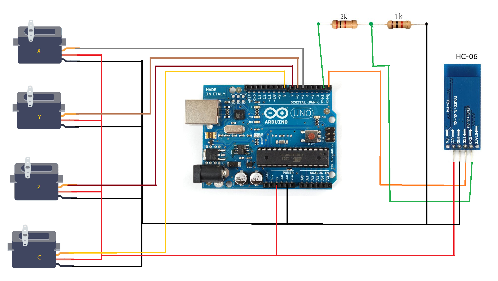
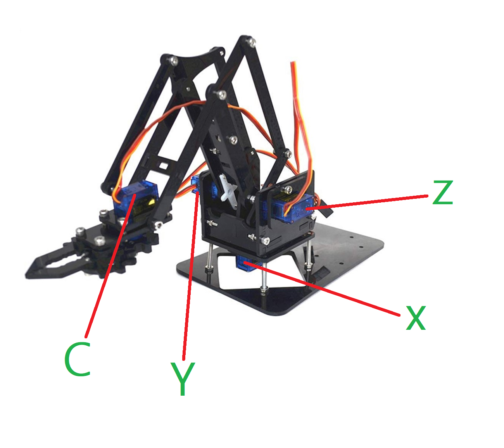

In this project, we move the robotic arm without physical contact.

#Project Materials
- Robotic Arm Kit: https://www.robotistan.com/plexiglas-robotic-arm-arduino-compatible
- Arduino Uno
- HC06 Serial Port Bluetooth Module: https://www.robotistan.com/hc06-serial-port-bluetooth-module

Circuit Design

Upload the arduino code in to your arduino mikrocontroller and run the python code.
